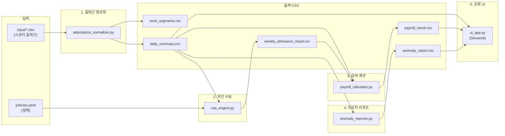
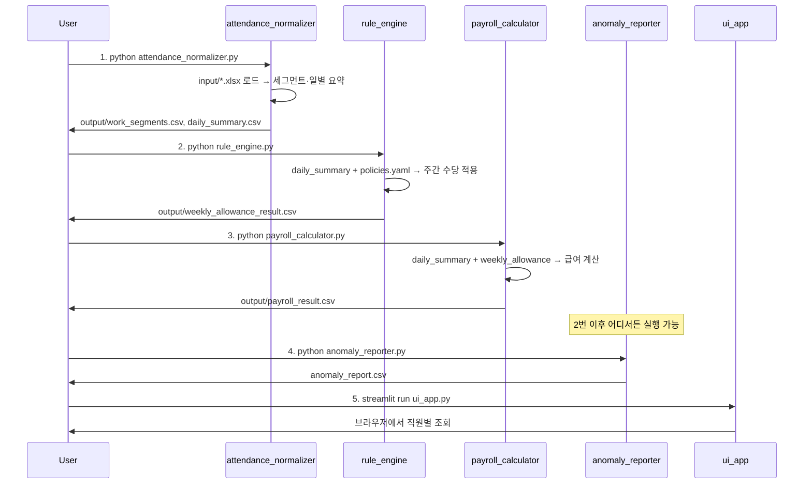

# Chaftee 시스템 흐름도

## 1. 시스템 개요

시프티(Shiftie) 출퇴근 엑셀을 입력으로 받아 **근무 세그먼트 → 일별 요약 → 주간 수당 정책 적용 → 급여 계산**까지 한 번에 처리하는 HR 급여 검증 파이프라인입니다.

| 구분 | 설명 |
|------|------|
| **입력** | `input/` 폴더 내 시프티 엑셀 1개 (`.xlsx`) |
| **설정** | `policies.yaml` (계약 유형·주간 수당 정책) |
| **출력** | `output/` 폴더 내 CSV 4종 + (선택) `anomaly_report.csv` |
| **UI** | Streamlit 앱으로 직원별 일별 근무·급여·이상치 조회 |

---

## 2. 전체 데이터 흐름도



---

## 3. 실행 순서 (파이프라인)



---

## 4. 스크립트별 상세

### 4.1 attendance_normalizer.py

**역할**: 시프티 엑셀 → 근무 세그먼트 + 일별 요약

| 단계 | 함수 | 설명 |
|------|------|------|
| 입력 탐색 | `find_input_file()` | `input/` 폴더에서 `.xlsx` 파일 1개만 허용, 없거나 2개 이상이면 예외 |
| 로드 | `load_shiftie(path)` | 엑셀 읽기, 필수 컬럼 검사: `사원번호`, `날짜`, `출근시간`, `퇴근시간`, `휴게시간` |
| 시간 결합 | `combine_dt()`, `_to_time()` | 날짜+출근/퇴근 시간을 KST `datetime`으로 변환 |
| 휴게 파싱 | `parse_break_minutes()` | "90분", "1시간 30분", "01:30", 숫자 등 다양한 형식 → 분 단위 정수 |
| 세그먼트 | `build_segments(df)` | 행별로 WORK 세그먼트 생성 (자정 넘김 보정, 휴게시간은 컬럼으로 보관) |
| 일별 요약 | `build_daily_summary(seg)` | 직원·일자별 work_minutes, break_minutes, net_minutes, scheduled_minutes(480), anomalies([]) |

**입력**: `input/*.xlsx` (시프티 형식)  
**출력**: `output/work_segments.csv`, `output/daily_summary.csv`

---

### 4.2 rule_engine.py

**역할**: 일별 요약을 주 단위로 묶고, YAML 정책에 따라 주간 수당 지급 여부·분량 결정

| 단계 | 함수 | 설명 |
|------|------|------|
| 정책 로드 | `load_policy()` | `policies.yaml`을 `yaml.safe_load` |
| 주간 집계 | `build_weekly_metrics(daily)` | `week_start`(월요일) 기준으로 직원·주별 `total_work_minutes`, `worked_days`, `contract_type`, `scheduled_minutes_per_day` |
| 조건 평가 | `check_conditions(metrics, conds)` | `OPS` 딕셔너리로 `>=`, `>`, `<`, `<=`, `==` 비교 |
| 정책 적용 | `apply_policy(weekly, cfg)` | `contract_type`별로 `weekly_allowance_policy` 참조 → conditions 만족 시 `scheduled_minutes_per_day`만큼 수당(분), 아니면 0 |

**입력**: `output/daily_summary.csv`, `policies.yaml`  
**출력**: `output/weekly_allowance_result.csv`

---

### 4.3 payroll_calculator.py

**역할**: 일별 근무 + 주간 수당 → 직원별 급여 합계 (기본급·연장·주간 수당)

| 상수 | 값 | 의미 |
|------|-----|------|
| `HOURLY_WAGE` | 11000 | 시급 |
| `OT_MULTIPLIER` | 1.5 | 연장 가산 |
| `DAILY_OT_THRESHOLD` | 8*60 | 8시간 초과분만 연장으로 인정 |

| 단계 | 함수 | 설명 |
|------|------|------|
| 일별 계산 | `calc_daily(row)` | `net_minutes`를 8시간 기준으로 나누어 기본급·연장급 산출 |
| 집계 | `main()` | 직원별로 일별 base/OT 합산 + `weekly_allowance_result`의 `weekly_allowance_minutes`를 시급으로 환산해 `weekly_allowance_pay` 추가 → `total_pay` |

**입력**: `output/daily_summary.csv`, `output/weekly_allowance_result.csv`  
**출력**: `output/payroll_result.csv`

---

### 4.4 anomaly_reporter.py

**역할**: 일별 요약에서 `anomalies`가 비어 있지 않은 행만 추려 리포트 생성

| 단계 | 함수 | 설명 |
|------|------|------|
| 리포트 | `build_anomaly_report(daily_df)` | `r.anomalies`가 있고 `eval(r.anomalies)` 길이 > 0인 행만 수집 (employee_id, date, anomalies, net_minutes) |

**입력**: `daily_summary.csv` (현재 스크립트는 **프로젝트 루트** 기준, `output/` 미사용)  
**출력**: `anomaly_report.csv` (루트에 생성)

---

### 4.5 ui_app.py

**역할**: Streamlit으로 직원 선택 시 일별 근무·급여 결과·이상치 테이블 표시

- `daily_summary.csv`, `payroll_result.csv`, `anomaly_report.csv`를 **현재 작업 디렉터리**에서 읽음 (`output/` 경로 없음).
- 실행: `streamlit run ui_app.py`

---

## 5. policies.yaml 구조

```yaml
contract_types:
  standard_9to6:
    weekly_allowance_policy: weekly_allowance_standard

policies:
  weekly_allowance_standard:
    conditions:
      - metric: total_work_minutes
        operator: ">="
        value: 2400
      - metric: worked_days
        operator: ">="
        value: 5
```

- **contract_types**: 계약 유형별로 적용할 주간 수당 정책 ID 지정.
- **policies**: 정책 ID별로 `conditions` 리스트 정의.  
  - `total_work_minutes >= 2400` (주 40시간)  
  - `worked_days >= 5` (주 5일 출근)  
  두 조건을 모두 만족할 때만 해당 주의 `scheduled_minutes_per_day`만큼 주간 수당(분) 지급.

---

## 6. 파일·의존성 요약

| 파일 | 읽는 파일 | 쓰는 파일 | 기타 의존성 |
|------|-----------|-----------|-------------|
| attendance_normalizer.py | input/*.xlsx | output/work_segments.csv, output/daily_summary.csv | pandas, openpyxl |
| rule_engine.py | output/daily_summary.csv, policies.yaml | output/weekly_allowance_result.csv | pandas, pyyaml |
| payroll_calculator.py | output/daily_summary.csv, output/weekly_allowance_result.csv | output/payroll_result.csv | pandas |
| anomaly_reporter.py | daily_summary.csv | anomaly_report.csv | pandas |
| ui_app.py | daily_summary.csv, payroll_result.csv, anomaly_report.csv | — | streamlit, pandas |

---

## 7. 권장 실행 순서 및 경로 통일

1. `python attendance_normalizer.py`
2. `python rule_engine.py`
3. `python payroll_calculator.py`
4. (선택) `python anomaly_reporter.py`
5. `streamlit run ui_app.py`

**참고**: `anomaly_reporter.py`와 `ui_app.py`는 CSV 경로가 `output/`이 아닌 **현재 디렉터리**로 되어 있습니다.  
`output/`에서만 CSV를 사용하려면 두 스크립트에서 파일 경로를 `output/daily_summary.csv` 등으로 맞추는 것이 좋습니다.

---

## 8. 요약 다이어그램 (한 장 요약)

```
[ input/*.xlsx ]  ──► attendance_normalizer  ──► work_segments.csv
                              │
                              └──────────────────► daily_summary.csv
                                                          │
[ policies.yaml ]  ──► rule_engine  ◄─────────────────────┘
                              │
                              └──────────────────► weekly_allowance_result.csv
                                                          │
                    payroll_calculator  ◄──────────────────┘
                              │         ◄──── daily_summary.csv
                              └──────────────────► payroll_result.csv

                    anomaly_reporter  ◄──── daily_summary.csv
                              │
                              └──────────────────► anomaly_report.csv

                    ui_app (Streamlit)  ◄──── daily_summary, payroll_result, anomaly_report
```
